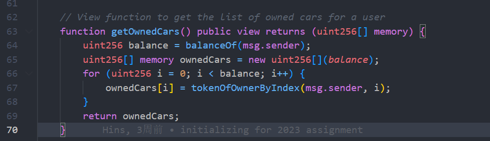
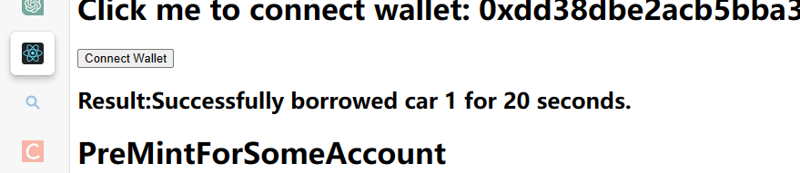

# ZJU-blockchain-course-2023-HW2

⬆ 学号：3200102869

> 第二次作业要求（以下内容提交时可以删除）：
> 
> 简易汽车借用系统，参与方包括：汽车拥有者，有借用汽车需求的用户
>
> 背景：ERC-4907 基于 ERC-721 做了简单的优化和补充，允许用户对NFT进行租借。
> - 创建一个合约，在合约中发行NFT集合，每个NFT代表一辆汽车。给部分用户测试领取部分汽车NFT，用于后面的测试。
> - 在网站中，默认每个用户的汽车都可以被借用。每个用户可以： 
>    1. 查看自己拥有的汽车列表。查看当前还没有被借用的汽车列表。
>    2. 查询一辆汽车的主人，以及该汽车当前的借用者（如果有）。
>    3. 选择并借用某辆还没有被借用的汽车一定时间。
>    4. 上述过程中借用不需要进行付费。
> 
> - （Bonus）使用自己发行的积分（ERC20）完成付费租赁汽车的流程
> - 请大家专注于功能实现，网站UI美观程度不纳入评分标准，但要让用户能够舒适操作。简便起见，可以在网上找图片代表不同汽车，不需要将图片在链上进行存储。

**以下内容为作业仓库的README.md中需要描述的内容。请根据自己的需要进行修改并提交。**

作业提交方式为：**提交视频文件**和**仓库的链接**到指定邮箱。

## 如何运行

补充如何完整运行你的应用。

1. 在本地启动ganache应用。并修改合约文件中预先分配的币：

    首先观察ganache中的钱包地址：

    

    然后使用这里的钱包地址替换下面contracts\contracts\BorrowYourCar.sol文件中的constructor, 即预先分配的时候，这里的mint函数经过包装，能够自动为用户增加token为第二个参数的车辆。

    

2. 在 `./contracts` 中安装需要的依赖，运行如下的命令：
    ```bash
    npm install
    ```

3. 在 `./contracts` 中编译合约，运行如下的命令：
    ```bash
    npx hardhat compile
    ```

    运行该命令后，将在artifacts/contracts/BorrowYourCar.sol目录下生成对应合约的ABI json文件：

    

    将这个json文件，复制到frontend/src/Utils/abis/BorrowYourcar.json, （若合约没有被修改则无所谓，可以不复制，但若变动ABI请务必更新该json文件）

4. 在ganache上部署应用，运行如下的命令：

    ```bash
    npx hardhat run scripts/deploy.ts --network ganache
    ```
    该指令将在命令行终端输出部署的合约地址:

    

     将其复制保存。

5. 修改frontend\src\utils\contract-address.json中的地址：

    

    其中BorrowYourCar为第四步保存的合约地址，defaultUser为随意选择的ganache用户地址：
    

6. 在 `./frontend` 中安装需要的依赖，运行如下的命令：
    ```bash
    npm install
    ```

7. 在 `./frontend` 中启动前端程序，运行如下的命令：
    ```bash
    npm run start
    ```

## 功能实现分析

简单描述：项目完成了要求的哪些功能？每个功能具体是如何实现的？

1. 创 建 一 个 合 约 ， 在 合 约 中 发 行 NFT 集 合 ， 每 个 NFT 代 表 一 辆 汽 车 。 

   ​	通过在mint, borrowCar, returnCar等函数中，同时处理NFT和汽车的结构体，如下面的mint, 将处理NFT的_mint和对cars结构体映射的修正同时进行处理，从而实现了NFT和汽车的一一对应。

   

2.  给 部 分 用 户 测 试 领 取 部 分 汽 车 NFT ， 用 于 后 面 的 测 试 。 在 网 站 中 ， 默 认 每 个 用 户 的 汽 车 都 可 以 被 借 用 。 

   

   ​	如图，我在合约的构造函数中提前为两个不同的用户各分配了三辆车的NFT token， 从而实现用户的领取。

3.  每 个 用 户 可 以查 看 自 己 拥 有 的 汽 车 列 表 。 

   这里通过ERC721Enumable的函数，通过NFT的balance和tokenOfOwnerByIndex函数，实现了脱离cars结构体，检查当前用户所拥有的NFT的效果。

   ​	

   在前端则收集web3返回的内容并呈现在页面上：

   

   

   

4.  查 看 当 前 还 没 有 被 借 用 的 汽 车 列 表 。 

   当前还没有借用的汽车列表被维护在AvailableCarList中，通过以下两个内部函数维护，这两个函数只由BorrowCar和ReturnCar修改，保证了AvailableCarList的始终有效：

   

   前端的实现与OwnedCar类似，不再赘述。

5.  查 询 一 辆 汽 车 的 主 人 ， 以 及 该 汽 车 当 前 的 借 用 者 （ 如 果 有 ） 。 

   在合约侧，我将Car的字段返回给了查询方：

   

   而在前端，我定义了CarInfo的变量，将getCarInfo返回的所有信息存储下来，并呈现在了页面上。

   

   

6. 选 择 并 借 用 某 辆 还 没 有 被 租 借 的 汽 车 一 定 时 间 。 

​		在合约侧，完成了borrowCar和returnCar两个函数，分别负责借用和归还。


​	由于区块链只能由调用者主动触发，因此考虑将自动归还的逻辑在前端实现：


​	在这里，除了调用borrow函数，还会设置一个定时函数，当合约生效后，将等待对应的duration+5s后，自动将车辆返还。

​	当然，为了方便测试，我还是单独列出了一个归还的接口：


## 项目运行截图

放一些项目运行截图。

项目运行成功的关键页面和流程截图。主要包括操作流程以及和区块链交互的截图。

关键页面：


借用1号20s:


metamask同意后，即生效借用



此时avalableList中的 1号消失，查询信息发现已经有了借用者


20s后自动归还：


查询AvaliableList并查询car信息：


可见信息更新，即成功归还。

## 参考内容

- 课程的参考Demo见：[DEMOs](https://github.com/LBruyne/blockchain-course-demos)。

- ERC-4907 [参考实现](https://eips.ethereum.org/EIPS/eip-4907)

如果有其它参考的内容，也请在这里陈列。
